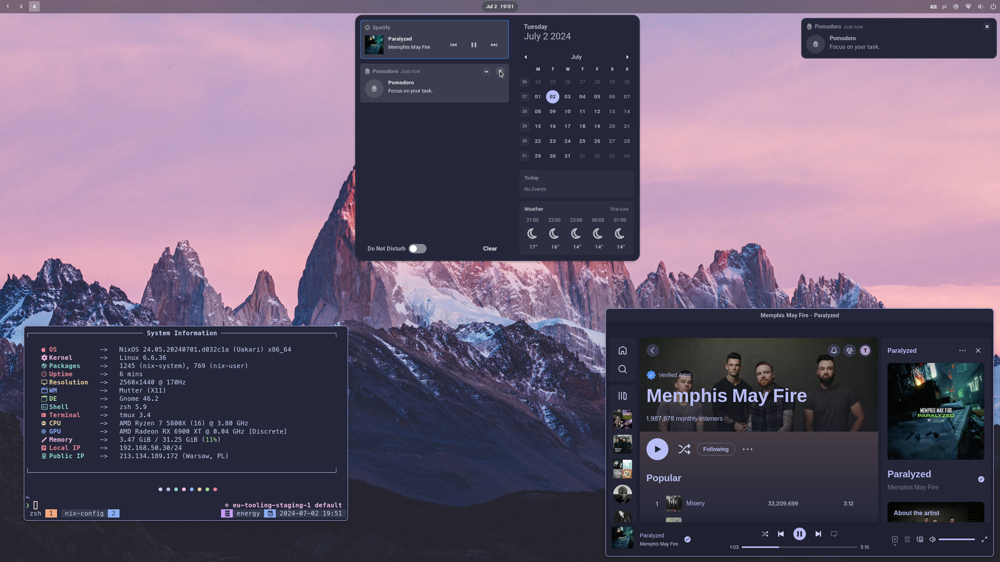

# NixOS and nix-darwin Configurations for My Machines

This repository contains NixOS and nix-darwin configurations for my machines, managed through [Nix Flakes](https://nixos.wiki/wiki/Flakes).

It is structured to easily accommodate multiple machines and user configurations, leveraging [nixpkgs](https://github.com/NixOS/nixpkgs), [home-manager](https://github.com/nix-community/home-manager), [nix-darwin](https://github.com/LnL7/nix-darwin), and various other community contributions for a seamless experience across NixOS and macOS.

## Showcase

### Hyprland


### Gnome



## Structure

- `flake.nix`: The flake itself, defining inputs and outputs for NixOS, nix-darwin, and Home Manager configurations.
- `hosts/`: NixOS and nix-darwin configurations for each machine, including system-specific settings.
- `home/`: Home Manager configurations for user-specific settings and applications.
- `files/`: Miscellaneous configuration files and scripts used across various applications and services.
- `flake.lock`: Lock file ensuring reproducible builds by pinning input versions.
- `overlays/`: Custom Nix overlays for package modifications or additions.

### Key Inputs

- **nixpkgs**: Points to the `nixos-24.05` channel, providing stable NixOS packages.
- **nixpkgs-unstable**: Points to the `nixos-unstable` channel for access to the latest packages.
- **home-manager**: Manages user-specific configurations, following the `nixpkgs` input (release-24.05).
- **hardware**: Optimizes settings for different hardware configurations.
- **catppuccin**: Provides global Catppuccin theme integration.
- **spicetify-nix**: Enhances Spotify client customization.
- **darwin**: Enables nix-darwin for macOS system configuration.
- **nix-homebrew**: Integrates Homebrew package management with nix-darwin.

## Usage

### Adding a New Machine with a New User

To add a new machine with a new user to your NixOS or nix-darwin configuration, follow these steps:

1. **Update `flake.nix`**:

   a. Add the new user to the `users` attribute set:

   ```nix
   users = {
     # Existing users...
     newuser = {
       email = "newuser@example.com";
       fullName = "New User";
       gitKey = "YOUR_GIT_KEY";
       name = "newuser";
     };
   };
   ```

   b. Add the new machine to the appropriate configuration set:

   For NixOS:

   ```nix
   nixosConfigurations = {
     # Existing configurations...
     newmachine = mkNixosConfiguration "newmachine" "newuser";
   };
   ```

   For nix-darwin:

   ```nix
   darwinConfigurations = {
     # Existing configurations...
     newmachine = mkDarwinConfiguration "newmachine" "newuser";
   };
   ```

   c. Add the new home configuration:

   ```nix
   homeConfigurations = {
     # Existing configurations...
     "newuser@newmachine" = mkHomeConfiguration "x86_64-linux" "newuser" "newmachine";
   };
   ```

2. **Create System Configuration**:

   a. Create a new directory under `hosts/` for your machine:

   ```sh
   mkdir -p hosts/newmachine
   ```

   b. Create `configuration.nix` in this directory:

   ```sh
   touch hosts/newmachine/configuration.nix
   ```

   c. Add the basic configuration to `configuration.nix`:

   For NixOS:

   ```nix
   { config, pkgs, ... }:

   {
     imports = [
       ./hardware-configuration.nix
       ../modules/common.nix
       # Add other relevant modules
     ];

     # Add machine-specific configurations here
   }
   ```

   For nix-darwin:

   ```nix
   { config, pkgs, ... }:

   {
     imports = [
       ../modules/common.nix
       # Add other relevant modules
     ];

     # Add machine-specific configurations here
   }
   ```

   d. For NixOS, generate `hardware-configuration.nix`:

   ```sh
   sudo nixos-generate-config --show-hardware-config > hosts/newmachine/hardware-configuration.nix
   ```

3. **Create Home Manager Configuration**:

   a. Create a new file for the user's home configuration:

   ```sh
   mkdir -p home/newuser
   touch home/newuser/newmachine.nix
   ```

   b. Add basic home configuration:

   ```nix
   { config, pkgs, ... }:

   {
     imports = [
       ../modules/common.nix
       # Add other relevant modules
     ];

     # Add user-specific configurations here
   }
   ```

4. **Building and Applying Configurations**:

   a. Do not forget to check-in new files in git by running `git add .`

   b. Build and switch to the new system configuration:

   For NixOS:

   ```sh
   sudo nixos-rebuild switch --flake .#newmachine
   ```

   For nix-darwin:

   ```sh
   darwin-rebuild switch --flake .#newmachine
   ```

   c. Build and switch to the new Home Manager configuration:

   ```sh
   home-manager switch --flake .#newuser@newmachine
   ```

## Updating Flakes

To update all flake inputs to their latest versions:

```sh
nix flake update
```

## Custom Modules and Configurations

This setup includes a wide range of custom modules and configurations to enhance your NixOS and macOS experience. Here's a comprehensive list of available modules:

### System Modules (in `hosts/modules/`)

- `common.nix`: Common system configurations
- `corectrl.nix`: CoreCtrl for AMD GPU management
- `gnome.nix`: GNOME desktop environment
- `hyprland.nix`: Hyprland window manager
- `laptop.nix`: Laptop-specific configurations
- `lutris.nix`: Lutris gaming platform
- `ollama.nix`: Ollama for running large language models locally
- `steam.nix`: Steam gaming platform

### Home Manager Modules (in `home/modules/`)

1. Terminal and Shell:

   - `alacritty.nix`: Alacritty terminal emulator
   - `atuin.nix`: Shell history sync
   - `zsh.nix`: Zsh shell configuration
   - `tmux.nix`: Terminal multiplexer

2. Development Tools:

   - `git.nix`: Git version control
   - `go.nix`: Go programming language
   - `neovim.nix`: Neovim text editor
   - `lazygit.nix`: Terminal UI for Git

3. System Utilities:

   - `bat.nix`: A cat clone with syntax highlighting
   - `bottom.nix`: System monitor
   - `clipboard.nix`: Cliphist clipboard manager (for Hyprland)
   - `fastfetch.nix`: System information tool
   - `fzf.nix`: Fuzzy finder
   - `gpg.nix`: GPG key management
   - `krew.nix`: kubectl plugin manager

4. Desktop Environment and UI:

   - `gnome.nix`: GNOME desktop customizations
   - `gtk.nix`: GTK theme settings
   - `hyprland.nix`: Hyprland window manager configuration
   - `kanshi.nix`: Automatic display configuration
   - `pop-shell.nix`: Pop Shell for tiling windows
   - `swaync.nix`: Notification center for Wayland
   - `waybar.nix`: Highly customizable Wayland bar
   - `wofi.nix`: Application launcher for Wayland

5. Applications:

   - `corectrl.nix`: GPU controls and monitoring
   - `easyeffects.nix`: Audio effects for PipeWire
   - `flameshot.nix`: Screenshot tool
   - `normcap.nix`: OCR tool
   - `spicetify.nix`: Spotify client customization
   - `swappy.nix`: Wayland screenshot editing tool
   - `ulauncher.nix`: Application launcher
   - `zoom.nix`: Zoom video conferencing

6. Cloud and DevOps:

   - `saml2aws.nix`: CLI tool for SAML SSO

7. macOS-specific:

   - `darwin-aerospace.nix`: macOS-specific configurations

8. Miscellaneous:
   - `home.nix`: Main home configuration
   - `scripts.nix`: Custom scripts
   - `xdg.nix`: XDG base directory specification

Each of these modules can be imported into your NixOS, nix-darwin, or Home Manager configurations to enable specific features or applications. To use a module, simply add it to the `imports` list in your configuration file.

For example, to enable Alacritty and Neovim in your home configuration:

```nix
{ config, pkgs, ... }:

{
  imports = [
    ./modules/alacritty.nix
    ./modules/neovim.nix
    # Other modules...
  ];

  # Additional configurations...
}
```

Feel free to explore these modules and customize your NixOS or macOS setup according to your needs. If you need more information about a specific module, you can check its corresponding file in the `hosts/modules/` or `home/modules/` directory.

## Contributing

Contributions are welcome! If you have improvements or suggestions, please open an issue or submit a pull request.

## License

This repository is licensed under MIT License. Feel free to use, modify, and distribute according to the license terms.
