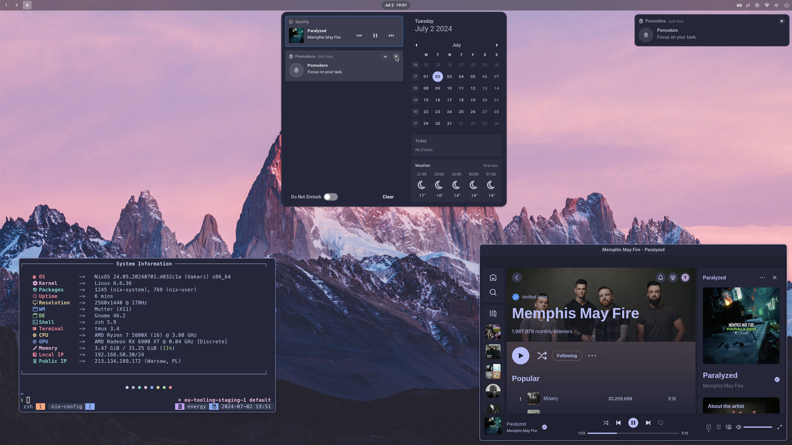

# NixOS and nix-darwin Configurations for My Machines

This repository contains NixOS and nix-darwin configurations for my machines, managed through [Nix Flakes](https://nixos.wiki/wiki/Flakes).

It is structured to easily accommodate multiple machines and user configurations, leveraging [nixpkgs](https://github.com/NixOS/nixpkgs), [home-manager](https://github.com/nix-community/home-manager), [nix-darwin](https://github.com/LnL7/nix-darwin), and various other community contributions for a seamless experience across NixOS and macOS.

## Showcase

### Hyprland


### Gnome



### macOS


## Structure

- `flake.nix`: The flake itself, defining inputs and outputs for NixOS, nix-darwin, and Home Manager configurations.
- `hosts/`: NixOS and nix-darwin configurations for each machine
- `home/`: Home Manager configurations for each machine
- `files/`: Miscellaneous configuration files and scripts used across various applications and services
- `modules/`: Reusable platform-specific modules
  - `nixos/`: NixOS-specific modules
  - `darwin/`: macOS-specific modules
  - `home-manager/`: User-space configuration modules
- `flake.lock`: Lock file ensuring reproducible builds by pinning input versions
- `overlays/`: Custom Nix overlays for package modifications or additions

### Key Inputs

- **nixpkgs**: Points to the `nixos-unstable` channel for access to the latest packages
- **nixpkgs-stable**: Points to the `nixos-24.11` channel, providing stable NixOS packages
- **home-manager**: Manages user-specific configurations, following the `nixpkgs` input (release-24.11)
- **hardware**: Optimizes settings for different hardware configurations
- **catppuccin**: Provides global Catppuccin theme integration
- **spicetify-nix**: Enhances Spotify client customization
- **darwin**: Enables nix-darwin for macOS system configuration
- **nix-homebrew**: Integrates Homebrew package management with nix-darwin

## Usage

### Adding a New Machine with a New User

To add a new machine with a new user to your NixOS or nix-darwin configuration, follow these steps:

1. **Update `flake.nix`**:

   a. Add the new user to the `users` attribute set:

   ```nix
   users = {
     # Existing users...
     newuser = {
       avatar = ./files/avatar/face;
       email = "newuser@example.com";
       fullName = "New User";
       gitKey = "YOUR_GIT_KEY";
       name = "newuser";
     };
   };
   ```

   b. Add the new machine to the appropriate configuration set:

   For NixOS:

   ```nix
   nixosConfigurations = {
     # Existing configurations...
     newmachine = mkNixosConfiguration "newmachine" "newuser";
   };
   ```

   For nix-darwin:

   ```nix
   darwinConfigurations = {
     # Existing configurations...
     newmachine = mkDarwinConfiguration "newmachine" "newuser";
   };
   ```

   c. Add the new home configuration:

   ```nix
   homeConfigurations = {
     # Existing configurations...
     "newuser@newmachine" = mkHomeConfiguration "x86_64-linux" "newuser" "newmachine";
   };
   ```

2. **Create System Configuration**:

   a. Create a new directory under `hosts/` for your machine:

   ```sh
   mkdir -p hosts/newmachine
   ```

   b. Create `default.nix` in this directory:

   ```sh
   touch hosts/newmachine/default.nix
   ```

   c. Add the basic configuration to `default.nix`:

   For NixOS:

   ```nix
   { inputs, hostname, nixosModules, ... }:
   {
     imports = [
       inputs.hardware.nixosModules.common-cpu-amd
       ./hardware-configuration.nix
       "${nixosModules}/common"
       "${nixosModules}/programs/hyprland"
     ];

     networking.hostName = hostname;
   }
   ```

   For nix-darwin:

   ```nix
   { config, pkgs, ... }:
   {
     # Add machine-specific configurations here
   }
   ```

   d. For NixOS, generate `hardware-configuration.nix`:

   ```sh
   sudo nixos-generate-config --show-hardware-config > hosts/newmachine/hardware-configuration.nix
   ```

3. **Create Home Manager Configuration**:

   a. Create a new directory for the user's host-specific configuration:

   ```sh
   mkdir -p home/newuser/newmachine
   touch home/newuser/newmachine/default.nix
   ```

   b. Add basic home configuration:

   ```nix
   { nhModules, ... }:
   {
     imports = [
       "${nhModules}/common"
       "${nhModules}/programs/neovim"
       "${nhModules}/services/waybar"
     ];
   }
   ```

4. **Building and Applying Configurations**:

   a. Commit new files to git:

   ```sh
   git add .
   ```

   b. Build and switch to the new system configuration:

   For NixOS:

   ```sh
   sudo nixos-rebuild switch --flake .#newmachine
   ```

   For nix-darwin (requires Nix and nix-darwin installation first):

   ```sh
   darwin-rebuild switch --flake .#newmachine
   ```

   c. Build and switch to the new Home Manager configuration:

> [!IMPORTANT]
> On fresh systems, bootstrap Home Manager first:

```sh
nix-shell -p home-manager
home-manager switch --flake .#newuser@newmachine
```

After this initial setup, you can rebuild configurations separately and home-manager will be available without additional steps

## Updating Flakes

To update all flake inputs to their latest versions:

```sh
nix flake update
```

## Modules and Configurations

### System Modules (in `modules/nixos/`)

- `common/`: Common system configurations
- `desktop/gnome.nix`: GNOME desktop environment
- `desktop/hyprland.nix`: Hyprland window manager
- `programs/corectrl.nix`: CoreCtrl for AMD GPU management
- `programs/steam.nix`: Steam gaming platform
- `services/tlp.nix`: Laptop power management

### Home Manager Modules (in `modules/home-manager/`)

1. **Core Utilities**:

   - `common/`: Cross-platform base configuration
   - `programs/git.nix`: Git version control
   - `programs/neovim.nix`: Neovim text editor
   - `programs/zsh.nix`: Zsh shell configuration

2. **Desktop Environment**:

   - `deskotp/gnome/`: Gnome configuration
   - `deskotp/hyprland/`: Hyprland window manager setup
   - `services/waybar/`: Custom status bar configuration
   - `services/swaync/`: Notification center setup

3. **Development**:

   - `programs/go.nix`: Go development environment
   - `programs/krew.nix`: Kubernetes plugin manager
   - `scripts/`: Collection of development utilities

4. **macOS Specific**:
   - `programs/aerospace.nix`: macOS window management

## Contributing

Contributions are welcome! If you have improvements or suggestions, please open an issue or submit a pull request.

## License

This repository is licensed under MIT License. Feel free to use, modify, and distribute according to the license terms.
