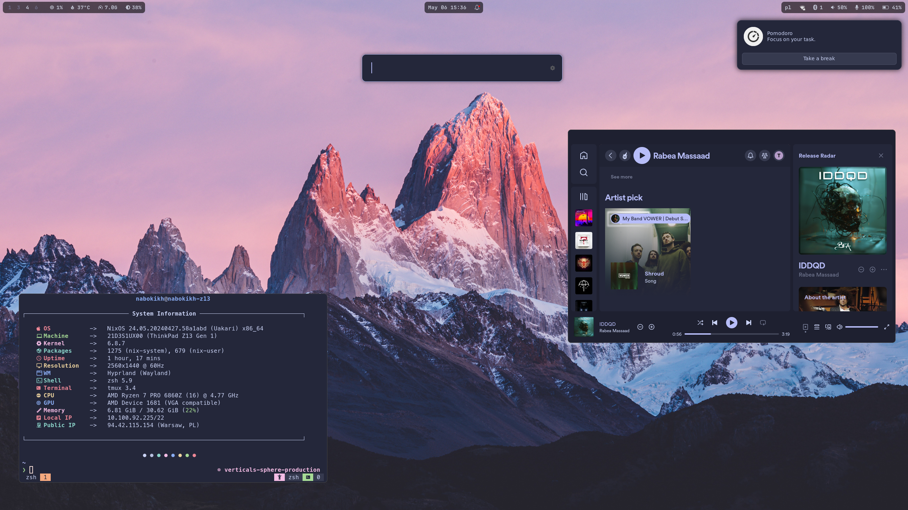

# NixOS Configurations for My Machines

This repository contains NixOS configurations for my machines, managed through [Nix Flakes](https://nixos.wiki/wiki/Flakes).

It is structured to easily accommodate multiple machines and user configurations, leveraging [nixpkgs](https://github.com/NixOS/nixpkgs), [home-manager](https://github.com/nix-community/home-manager), and various other community contributions for a seamless NixOS experience.

## Showcase



## Structure

- `flake.nix`: The flake itself, defining inputs (such as nixpkgs, home-manager, and hardware-specific optimizations) and outputs for NixOS and Home Manager configurations.
- `hosts/`: NixOS configurations for each machine, including system-specific settings.
- `home/`: Home Manager configurations for user-specific settings and applications.
- `files/`: Miscellaneous configuration files and scripts used across various applications and services.
- `flake.lock`: Lock file ensuring reproducible builds by pinning input versions.

### Key Inputs

- **nixpkgs**: Points to the `nixos-unstable` channel, providing the latest NixOS packages.
- **home-manager**: Manages user-specific configurations, following the `nixpkgs` input.
- **hardware**: Optimizes settings for different hardware configurations.
- **spicetify-nix**: Enhances Spotify client customization.
- **hyprland**: A Wayland compositor configuration tailored for my setups.

## Usage

### Building and Applying NixOS Configurations

To apply a configuration to a specific system, run:

```sh
nixos-rebuild switch --flake .#<hostname>
```

Replace `hostname` with the name of the target machine, e.g., `energy` or `nabokikh-z13`.

### Managing Home Configuration

Home Manager is used to manage user configurations independently of system configurations. To apply a user configuration, use:

```sh
home-manager switch --flake .#<user>@<hostname>
```

## Updating Flakes

To update all flake inputs to their latest versions:

```sh
nix flake update
```

## Contributing

Contributions are welcome! If you have improvements or suggestions, please open an issue or submit a pull request.

## License

This repository is licensed under MIT License. Feel free to use, modify, and distribute according to the license terms.
