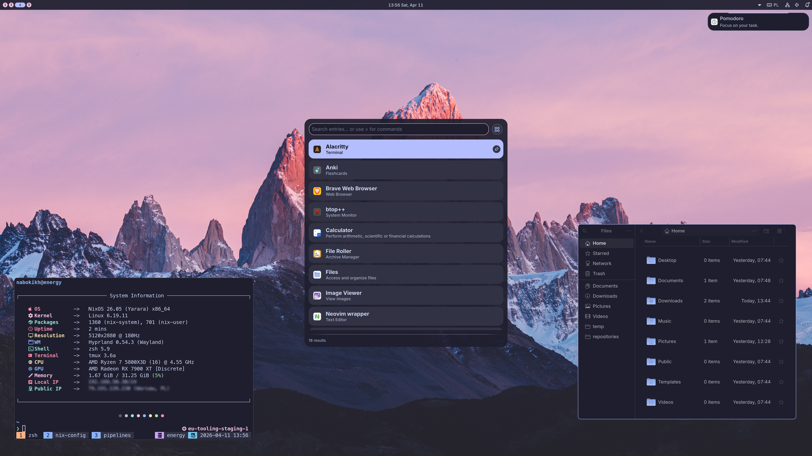

# NixOS and nix-darwin Configurations for My Machines

This repository contains my NixOS and nix-darwin configurations, managed through Nix Flakes.

It is designed for:

- NixOS machines
- macOS machines through `nix-darwin`
- user-level configuration through `home-manager`

The repo follows a dendritic pattern.

In practice, that means:

- small modules do one thing
- branch modules group related settings
- stacks combine reusable modules into host-level choices
- hosts stay short and easy to read

If you are new to Nix, the simplest mental model is:

- `hosts/` = real machines
- `modules/` = reusable building blocks
- `modules/stacks/` = convenient bundles of those building blocks
- `modules/profile/` = personal settings shared across hosts

## Showcase

### Hyprland / Niri



### macOS


## Repository Structure

```text
.
├── assets/                # Generic repo assets such as screenshots
├── hosts/                 # Concrete machine definitions
│   ├── energy/            # NixOS desktop host
│   └── work-mac/          # macOS host
├── modules/               # Reusable configuration building blocks
│   ├── configurations/    # Host configuration wrappers (nixosSystem, darwinSystem)
│   ├── profile/           # Personal cross-host profile data and assets
│   ├── nixos/             # NixOS-only modules
│   ├── darwin/            # nix-darwin-only modules
│   ├── home-manager/      # Home Manager modules
│   └── stacks/            # Host-facing composition modules
├── flake.nix              # Flake inputs and top-level imports
├── flake.lock             # Locked input versions for reproducibility
├── Makefile               # Convenience rebuild/update/check commands
└── README.md              # Project documentation
```

- `flake.nix`: Defines flake inputs and uses `import-tree` to auto-import the module tree.
- `hosts/`: Concrete machine configurations such as `energy` and `work-mac`.
- `assets/`: Generic repository assets. Right now this mainly holds screenshots.
- `modules/configurations/`: Wrappers around `nixpkgs.lib.nixosSystem` and `darwin.lib.darwinSystem` that absorb common boilerplate (home-manager integration, `useGlobalPkgs`, etc.).
- `modules/profile/`: Personal cross-host data such as name, email, git key, avatar, and wallpaper.
- `modules/nixos/`: Reusable NixOS system modules.
- `modules/darwin/`: Reusable nix-darwin system modules.
- `modules/home-manager/`: Reusable user-level modules.
- `modules/stacks/`: Composition modules that combine lower-level modules into host-facing bundles.

## Terminology

### Host

A host is a real machine configuration.

Examples:

- `hosts/energy/default.nix`
- `hosts/work-mac/default.nix`

A host should mostly answer:

- what machine is this?
- which major environment does it use?

### Module

A module is a reusable piece of configuration.

Examples:

- `modules/nixos/base/networking.nix`
- `modules/home-manager/programs/git/default.nix`
- `modules/home-manager/services/hypridle/default.nix`

Modules are the leaves and branches of the tree.

Every `.nix` file under `modules/` is a flake-parts module, auto-imported by `import-tree`. Files or directories prefixed with `_` are excluded from auto-import.

### Stack

A stack is a higher-level composition module.

A stack groups multiple modules into something that is meaningful at the host level.

Examples:

- `nixos.stackLinuxBase`
- `nixos.stackHyprland`
- `nixos.stackNiri`
- `darwin.stackBase`
- `darwin.stackAerospace`

You can think of a stack as:

"Import this environment preset for this machine"

### Profile

The profile is the personal data shared across hosts.

In this repo it lives in:

- `modules/profile/`

It contains things like:

- full name
- email
- git signing key
- avatar
- wallpaper

## Modules and Configurations

### NixOS Modules (`modules/nixos/`)

- `base/`: Core system building blocks such as boot, networking, locale, users, packages, fonts, and containers.
- `desktop/`: System modules for standalone compositor environments.
- `roles/`: Higher-level system roles such as gaming.

Current desktop modules include:

- `desktop/compositor-common.nix`: Shared system settings for standalone compositors.
- `desktop/hyprland.nix`: Hyprland system integration.
- `desktop/niri.nix`: Niri system integration.

### Darwin Modules (`modules/darwin/`)

- `base/`: Common macOS settings such as defaults, fonts, sudo, keyboard, and user setup.

### Home Manager Modules (`modules/home-manager/`)

- `base/`: Shared packages and user-level defaults.
- `desktop/`: Desktop- or window-manager-specific modules.
- `programs/`: Modules that configure `programs.*`.
- `services/`: Modules that configure `services.*`.
- `scripts/`: Custom helper scripts installed into the user environment.

Examples:

- `programs/git/`: Git and delta configuration.
- `programs/noctalia/`: Noctalia Shell configuration.
- `programs/swappy/`: Screenshot annotation tool.
- `services/hypridle/`: Idle and lock management.
- `desktop/compositor-common/`: Shared Home Manager settings for standalone compositor desktops.
- `desktop/hyprland/`: Hyprland-specific user settings.
- `desktop/niri/`: Niri-specific user settings.
- `desktop/aerospace/`: AeroSpace configuration for macOS.

### Stack Modules (`modules/stacks/`)

Stacks connect system modules and Home Manager modules.

Current stacks:

- `linux-base.nix`: Shared Linux system base plus Home Manager base.
- `darwin-base.nix`: Shared macOS system base plus Home Manager base.
- `hyprland.nix`: Hyprland environment stack.
- `niri.nix`: Niri environment stack.
- `aerospace.nix`: AeroSpace setup for macOS.
- `compositor-base.nix`: Internal shared base for standalone compositor desktops.

`compositor-base.nix` is intentionally internal.

It holds the shared pieces for standalone compositors such as:

- Hyprland
- Niri
- Sway
- Wayfire

Hosts should import `nixos.stackHyprland` or `nixos.stackNiri`, not `nixos._stackCompositorBase` directly.

## How Composition Works

At a high level:

1. `flake.nix` uses `import-tree` to auto-import all `.nix` files under `modules/`
2. `modules/` exports reusable named modules via `flake.modules.<class>.<name>`
3. `modules/stacks/` combines those modules into host-facing bundles
4. `hosts/` uses `configurations.nixos` or `configurations.darwin` plus stacks to define real machines

That means the flow is roughly:

```text
leaf modules -> branch modules -> stacks -> hosts
```

This is what "dendritic" means in this repo.

## Current Hosts

### `energy`

- platform: NixOS
- imports: `nixos.stackLinuxBase`, `nixos.stackHyprland`
- extra role: `nixos.gaming`

### `work-mac`

- platform: macOS / nix-darwin
- imports: `darwin.stackBase`, `darwin.stackAerospace`

The Darwin configuration key remains:

- `PL-OLX-KCGXHGK3PY`

That matches the machine hostname and works well with the `Makefile` default.

## How To Read This Repo

If you are reading this repo for the first time, use this order:

1. `flake.nix`
2. `hosts/default.nix`
3. one real host, for example `hosts/energy/default.nix`
4. a stack used by that host, for example `modules/stacks/hyprland.nix`
5. the underlying modules pulled in by that stack

That gives you the high-level picture before the details.

## How To Use This Repo For Yourself

If you want to fork this repo and adapt it for your own systems, this is the easiest path.

### 1. Fork It

Fork the repository and clone your own copy.

### 2. Replace The Personal Profile

Edit:

- `modules/profile/preferences.nix`

Replace:

- full name
- email
- git key

You can also replace:

- `modules/profile/avatar`
- `modules/profile/wallpaper.jpg`

### 3. Remove Machines You Do Not Need

Delete or ignore hosts you do not use.

For example:

- if you only want NixOS, keep `hosts/energy/` as a starting point
- if you only want macOS, keep `hosts/work-mac/` as a starting point

### 4. Create A New Host

For a new NixOS host:

1. Create a new directory under `hosts/`, for example `hosts/laptop/`
2. Add `default.nix`
3. Generate `hardware.nix`:

```sh
sudo nixos-generate-config --show-hardware-config > hosts/laptop/hardware.nix
```

Start from `hosts/energy/default.nix` and change:

- hardware imports
- username
- stack choice

Minimal example:

```nix
{ inputs, config, ... }:
let
  inherit (config.flake.modules) nixos;
  username = "your-user";
in
{
  configurations.nixos.laptop.modules = [
    ./hardware.nix
    nixos.stackLinuxBase
    nixos.stackHyprland
    {
      primaryUser = username;
      system.stateVersion = "26.05";

      home-manager.users.${username} = {
        programs.home-manager.enable = true;
        home = {
          inherit username;
          homeDirectory = "/home/${username}";
          stateVersion = "26.05";
        };
      };
    }
  ];
}
```

For a new macOS host:

1. Create `hosts/my-mac/default.nix`
2. Start from `hosts/work-mac/default.nix`
3. Change:
   - hostname attr
   - username
   - stack choice

### 5. Pick The Right Stack

Common choices:

- `nixos.stackLinuxBase`: common Linux system + Home Manager base
- `nixos.stackHyprland`: Hyprland desktop stack
- `nixos.stackNiri`: Niri desktop stack
- `darwin.stackBase`: common macOS base
- `darwin.stackAerospace`: AeroSpace desktop setup for macOS

Rule of thumb:

- hosts import stacks
- stacks import modules
- leaf modules stay focused

### 6. Build It

For NixOS:

```sh
sudo nixos-rebuild switch --flake .#energy
```

For nix-darwin:

```sh
darwin-rebuild switch --flake .#PL-OLX-KCGXHGK3PY
```

Or use the `Makefile`:

```sh
make nixos-rebuild
make darwin-rebuild
make flake-check
```

The `Makefile` defaults to:

```text
.#$(hostname)
```

So it works best when the flake output name matches the machine hostname.

## How To Extend It

### Add a New Program Module

Put it under:

- `modules/home-manager/programs/<name>/default.nix`

Use this for modules that define `programs.*`.

The file will be auto-imported by `import-tree`.

### Add a New Service Module

Put it under:

- `modules/home-manager/services/<name>/default.nix`

Use this for modules that define `services.*`.

### Add a New Standalone Compositor

1. Add a NixOS module under `modules/nixos/desktop/`
2. Add a Home Manager desktop module under `modules/home-manager/desktop/<wm>/`
3. Reuse `modules/stacks/compositor-base.nix` where appropriate
4. Add a new stack under `modules/stacks/`
5. Import that stack from a host

### When Not To Create A Stack

Do not create a stack for every small shared detail.

Create a stack only when it represents a real host-level choice.

Good stack examples:

- Linux base
- Darwin base
- Hyprland
- Niri

Bad stack examples:

- one tiny package tweak
- one small default value
- an internal helper that no host should choose directly

## Notes For People New To Nix

If Nix feels confusing at first, that is normal.

The simplest mental model for this repo is:

- a host is a machine
- a module is a reusable config fragment
- a stack is a bundle of modules chosen at the host level
- the profile is personal data shared across machines

You do not need to understand every file before using the repo.

The safest way to change it is:

- start from one existing host
- keep the overall shape
- change one thing at a time
- run `nix flake check`

## Updating Flake Inputs

To update all flake inputs:

```sh
nix flake update
```

## License

This repository is licensed under the MIT License.
