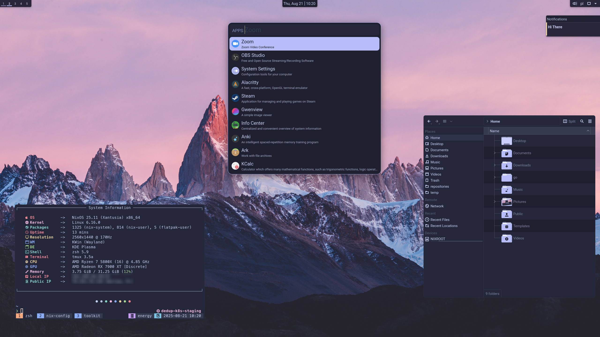

# NixOS and nix-darwin Configurations for My Machines

This repository contains NixOS and nix-darwin configurations for my machines, managed through [Nix Flakes](https://nixos.wiki/wiki/Flakes).

It is structured to easily accommodate multiple machines and user configurations, leveraging [nixpkgs](https://github.com/NixOS/nixpkgs), [home-manager](https://github.com/nix-community/home-manager), [nix-darwin](https://github.com/LnL7/nix-darwin), and various other community contributions for a seamless experience across NixOS and macOS.

## Showcase

### Hyprland


### KDE



### macOS


## Structure

- `flake.nix`: The flake itself, defining inputs and outputs for NixOS, nix-darwin, and Home Manager configurations.
- `hosts/`: NixOS and nix-darwin configurations for each machine (`energy`, `PL-OLX-KCGXHGK3PY`).
- `home/`: Home Manager configurations for each user on each machine.
- `files/`: Miscellaneous configuration files, scripts, avatars, and screenshots.
- `modules/`: Reusable platform-specific modules:
  - `nixos/`: NixOS-specific modules for system configuration.
  - `darwin/`: macOS-specific (nix-darwin) modules.
  - `home-manager/`: User-space configuration modules for applications and services.
- `overlays/`: Custom Nix overlays for package modifications or additions.
- `flake.lock`: Lock file ensuring reproducible builds by pinning input versions.

### Key Inputs

- **nixpkgs**: Points to the `nixos-unstable` channel for access to the latest packages.
- **nixpkgs-stable**: Points to the `nixos-25.11` channel for stable packages.
- **home-manager**: Manages user-specific configurations.
- **darwin**: Enables nix-darwin for macOS system configuration.
- **hardware**: Provides NixOS modules to optimize settings for different hardware.
- **catppuccin**: Provides global Catppuccin theme integration.
- **nix-flatpak**: Provides a declarative way to manage Flatpaks.
- **plasma-manager**: A declarative manager for the KDE Plasma desktop environment.

## Usage

### Adding a New Machine with a New User

To add a new machine with a new user to your NixOS or nix-darwin configuration, follow these steps:

1. **Update `flake.nix`**:

   a. Add the new user to the `users` attribute set:

   ```nix
   users = {
     # Existing users...
     newuser = {
       avatar = ./files/avatar/face;
       email = "newuser@example.com";
       fullName = "New User";
       gitKey = "YOUR_GIT_KEY";
       name = "newuser";
     };
   };
   ```

   b. Add the new machine to the appropriate configuration set:

   For NixOS:

   ```nix
   nixosConfigurations = {
     # Existing configurations...
     newmachine = mkNixosConfiguration "newmachine" "newuser";
   };
   ```

   For nix-darwin:

   ```nix
   darwinConfigurations = {
     # Existing configurations...
     newmachine = mkDarwinConfiguration "newmachine" "newuser";
   };
   ```

   c. Add the new home configuration:

   ```nix
   homeConfigurations = {
     # Existing configurations...
     "newuser@newmachine" = mkHomeConfiguration "x86_64-linux" "newuser" "newmachine";
   };
   ```

2. **Create System Configuration**:

   a. Create a new directory under `hosts/` for your machine:

   ```sh
   mkdir -p hosts/newmachine
   ```

   b. Create `default.nix` in this directory:

   ```sh
   touch hosts/newmachine/default.nix
   ```

   c. Add the basic configuration to `default.nix`:

   For NixOS:

   ```nix
   { inputs, hostname, nixosModules, ... }:
   {
     imports = [
       inputs.hardware.nixosModules.common-cpu-amd
       ./hardware-configuration.nix
       "${nixosModules}/common"
       "${nixosModules}/desktop/hyprland"
     ];

     networking.hostName = hostname;
   }
   ```

   For nix-darwin:

   ```nix
   { darwinModules, ... }:
   {
     imports = [
       "${darwinModules}/common"
     ];
     # Add machine-specific configurations here
   }
   ```

   d. For NixOS, generate `hardware-configuration.nix`:

   ```sh
   sudo nixos-generate-config --show-hardware-config > hosts/newmachine/hardware-configuration.nix
   ```

3. **Create Home Manager Configuration**:

   a. Create a new directory for the user's host-specific configuration:

   ```sh
   mkdir -p home/newuser/newmachine
   touch home/newuser/newmachine/default.nix
   ```

   b. Add basic home configuration:

   ```nix
   { nhModules, ... }:
   {
     imports = [
       "${nhModules}/common"
       # Add other home-manager modules
     ];
   }
   ```

4. **Building and Applying Configurations**:

   a. Commit new files to git:

   ```sh
   git add .
   ```

   b. Build and switch to the new system configuration:

   For NixOS:

   ```sh
   sudo nixos-rebuild switch --flake .#newmachine
   ```

   For nix-darwin (requires Nix and nix-darwin installation first):

   ```sh
   darwin-rebuild switch --flake .#newmachine
   ```

   c. Build and switch to the new Home Manager configuration:

> [!IMPORTANT]
> On fresh systems, bootstrap Home Manager first:

```sh
nix-shell -p home-manager
home-manager switch --flake .#newuser@newmachine
```

After this initial setup, you can rebuild configurations separately and home-manager will be available without additional steps

## Updating Flakes

To update all flake inputs to their latest versions:

```sh
nix flake update
```

## Modules and Configurations

### System Modules (in `modules/nixos/`)

- **`common`**: Common system configurations including bootloader, networking, PipeWire, fonts, and user settings.
- **`desktop/hyprland`**: Hyprland window manager with GDM, Bluetooth, and required system packages.
- **`desktop/kde`**: KDE Plasma desktop environment with SDDM.
- **`programs/steam`**: Steam gaming platform configuration.
- **`services/tlp`**: TLP configuration for advanced power management on laptops.

### Darwin Modules (in `modules/darwin/`)

- **`common`**: Common macOS configurations including system defaults, keyboard remapping, and user settings.

### Home Manager Modules (in `modules/home-manager/`)

- **`common`**: Common user-space configurations that import most other modules.
- **`desktop/hyprland`**: User-level settings for Hyprland, including keybindings and related services like Waybar and Swaync.
- **`desktop/kde`**: User-level settings for KDE Plasma, managed declaratively with `plasma-manager`.
- **`misc/gtk`**: GTK3/4 theming (Tela icons, Yaru cursor, Roboto font) and Catppuccin theme.
- **`misc/qt`**: Qt theming using Kvantum and Catppuccin on Linux.
- **`misc/wallpaper`**: Defines the default wallpaper path for desktops.
- **`misc/xdg`**: Manages XDG user directories and default MIME type associations.
- **`programs/aerospace` (Darwin):** Tiling window manager for macOS with custom keybindings and workspace rules.
- **`programs/alacritty`:** GPU-accelerated terminal emulator, configured for tmux integration and platform-specific settings.
- **`programs/albert` (Linux):** Application launcher and productivity tool.
- **`programs/atuin`:** Enhanced shell history with cloud sync capabilities.
- **`programs/bat`:** `cat` clone with syntax highlighting and Git integration.
- **`programs/brave`:** Web browser with XDG MIME type associations (Linux).
- **`programs/btop`:** Resource monitor with Vim keys.
- **`programs/fastfetch`:** Customized system information tool.
- **`programs/fzf`:** Command-line fuzzy finder with preview capabilities.
- **`programs/git`:** Version control system, configured with user details, GPG signing, and `delta` for diffs.
- **`programs/go`:** Golang development environment setup.
- **`programs/gpg`:** GnuPG settings and GPG agent configuration.
- **`programs/k9s`:** Kubernetes CLI to manage clusters, with custom hotkeys.
- **`programs/krew`:** Kubectl plugin manager with a predefined list of plugins.
- **`programs/lazygit`:** Terminal UI for Git.
- **`programs/neovim`:** Highly customized Neovim setup based on LazyVim.
- **`programs/obs-studio` (Linux):** Streaming and screen recording software.
- **`programs/saml2aws`:** For AWS authentication via SAML.
- **`programs/starship`:** Cross-shell prompt with custom configuration.
- **`programs/swappy` (Linux/Hyprland):** A tool for editing screenshots.
- **`programs/telegram`:** Desktop client for Telegram.
- **`programs/tmux`:** Terminal multiplexer with custom keybindings and Catppuccin theme.
- **`programs/wofi` (Linux/Hyprland):** Application launcher for Wayland.
- **`programs/zsh`:** Zsh shell with extensive aliases, completions, and custom keybindings.
- **`scripts`**: Deploys a collection of custom utility scripts to `~/.local/bin`.
- **`services/cliphist` (Linux/Hyprland):** Clipboard manager.
- **`services/easyeffects` (Linux):** Audio effects processor with a custom "mic" preset.
- **`services/flatpak` (Linux):** Declarative management of Flatpak applications.
- **`services/kanshi` (Linux/Hyprland):** Dynamic display output configuration.
- **`services/swaync` (Linux/Hyprland):** Notification daemon.
- **`services/waybar` (Linux/Hyprland):** Highly customized Wayland status bar.

## Contributing

Contributions are welcome! If you have improvements or suggestions, please open an issue or submit a pull request.

## License

This repository is licensed under the MIT License. Feel free to use, modify, and distribute according to the license terms.
